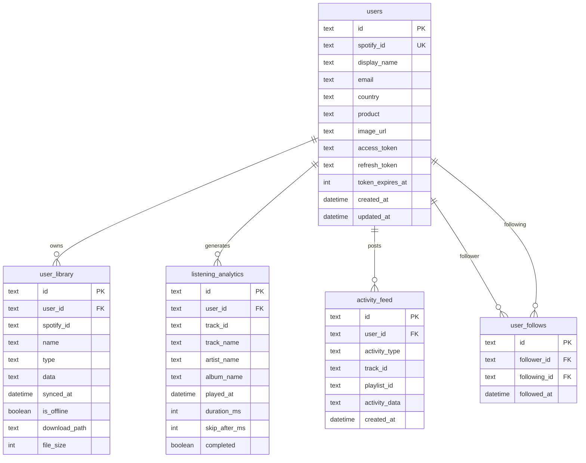

# VibeTune — Entity Relationship Diagram

This diagram matches the SQLite schema in `server/services/databaseService.ts`.

## Mermaid (render in GitHub, VS Code with Mermaid extension, or [mermaid.live](https://mermaid.live))



## Relationship summary

| From | To | Cardinality | Notes |
|------|-----|----------------|-------|
| `users` | `user_library` | 1 : N | `ON DELETE CASCADE`; unique `(user_id, spotify_id, type)` |
| `users` | `listening_analytics` | 1 : N | `ON DELETE CASCADE` |
| `users` | `activity_feed` | 1 : N | `ON DELETE CASCADE` |
| `users` | `user_follows` | N : M (via junction) | `follower_id` and `following_id` both reference `users.id`; unique pair |

## Crow’s-foot style (text)

```
users (1) ────< (N) user_library
users (1) ────< (N) listening_analytics
users (1) ────< (N) activity_feed
users (1) ────< (N) user_follows [follower_id]
users (1) ────< (N) user_follows [following_id]
```

---

**Tip:** Paste the `mermaid` block into [https://mermaid.live](https://mermaid.live) to export PNG/SVG for reports or slides.
