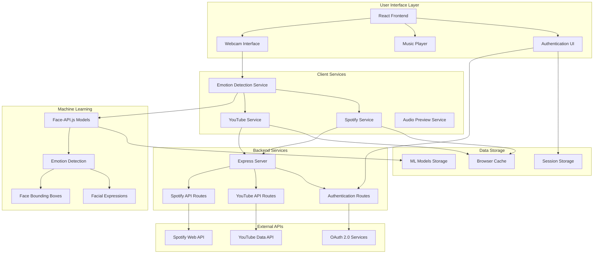
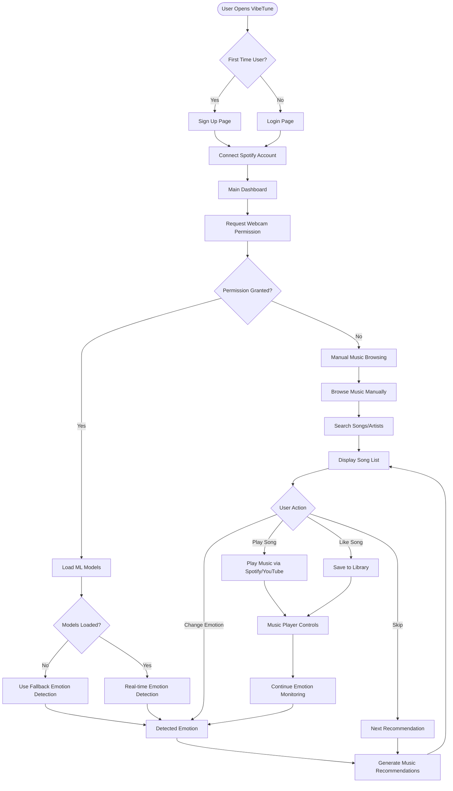
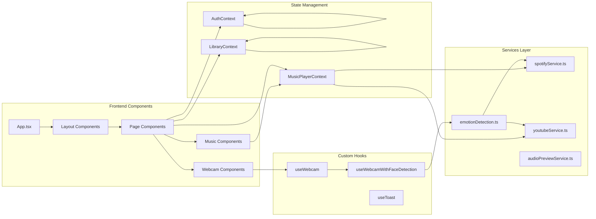
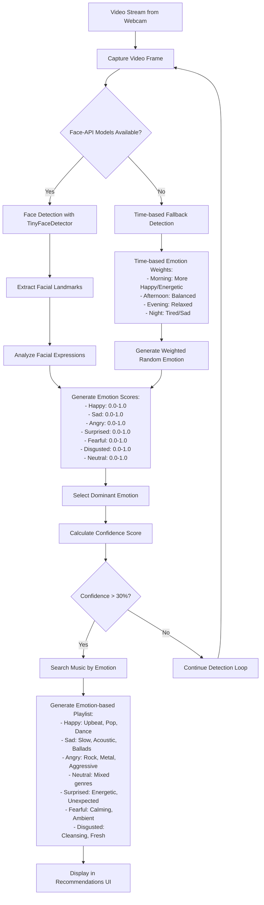
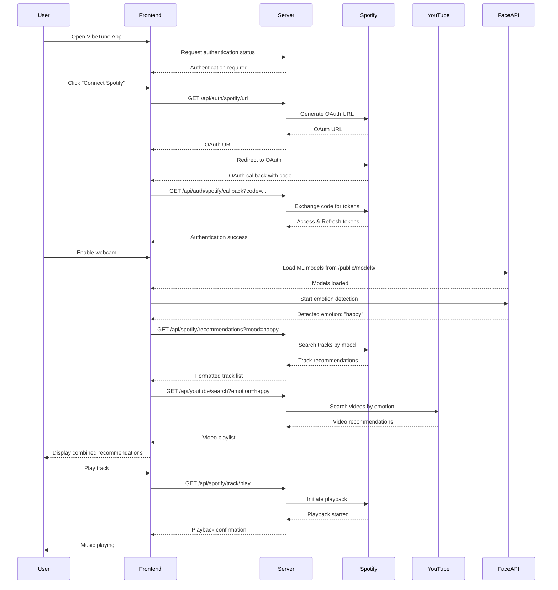

# VibeTune4 Project Flowchart Diagram

## System Architecture Overview



## User Journey Flow



## Technical Component Flow



## Emotion Detection Pipeline



## API Integration Flow



## File Structure & Dependencies

```mermaid
graph TD
    subgraph "Project Root"
        PKG[package.json]
        ENV[.env]
        CONFIG[Config Files]
    end
    
    subgraph "Client Folder"
        CLIENT_APP[App.tsx]
        
        subgraph "Pages"
            INDEX[Index.tsx]
            LOGIN[Login.tsx]
            PROFILE[Profile.tsx]
            WEBCAM_DEMO[WebcamDemo.tsx]
            CAMERA_TEST[CameraTest.tsx]
        end
        
        subgraph "Components"
            WEBCAM_CAP[WebcamCapture.tsx]
            FACE_DETECT[WebcamCaptureWithFaceDetection.tsx]
            EMOTION_REC[EmotionSongRecommendations.tsx]
            MUSIC_PLAYER[MusicPlayer.tsx]
            SIDEBAR[Sidebar.tsx]
        end
        
        subgraph "Services"
            EMOTION_SVC[emotionDetection.ts]
            SPOTIFY_SVC[spotifyService.ts]
            YOUTUBE_SVC[youtubeService.ts]
        end
        
        subgraph "Contexts"
            AUTH_CONTEXT[AuthContext.tsx]
            MUSIC_CONTEXT[MusicPlayerContext.tsx]
            LIB_CONTEXT[LibraryContext.tsx]
        end
        
        subgraph "Hooks"
            WEBCAM_HOOKS[useWebcam.ts]
            FACE_HOOKS[useWebcamWithFaceDetection.ts]
        end
    end
    
    subgraph "Server Folder"
        SERVER_INDEX[index.ts]
        
        subgraph "Routes"
            AUTH_ROUTE[auth.ts]
            SPOTIFY_ROUTE[spotify.ts]
            YOUTUBE_ROUTE[youtube.ts]
        end
        
        subgraph "Services"
            SERVER_SPOTIFY[spotifyService.ts]
            SERVER_YOUTUBE[youtubeService.ts]
            SERVER_MUSIC[musicService.ts]
        end
        
        subgraph "Middleware"
            AUTH_MIDDLEWARE[auth.ts]
        end
    end
    
    subgraph "Public Assets"
        MODELS[/models/ - ML Models]
        STATIC[Static Assets]
    end
    
    subgraph "Shared"
        API_TYPES[api.ts]
    end
    
    PKG --> CLIENT_APP
    PKG --> SERVER_INDEX
    
    CLIENT_APP --> PAGES
    PAGES --> COMPONENTS
    COMPONENTS --> SERVICES
    COMPONENTS --> CONTEXTS
    COMPONENTS --> HOOKS
    
    SERVICES --> EMOTION_SVC
    SERVICES --> SPOTIFY_SVC
    SERVICES --> YOUTUBE_SVC
    
    SERVER_INDEX --> AUTH_ROUTE
    SERVER_INDEX --> SPOTIFY_ROUTE
    SERVER_INDEX --> YOUTUBE_ROUTE
    
    AUTH_ROUTE --> AUTH_MIDDLEWARE
    SPOTIFY_ROUTE --> SERVER_SPOTIFY
    YOUTUBE_ROUTE --> SERVER_YOUTUBE
    
    EMOTION_SVC --> MODELS
    CLIENT_APP --> API_TYPES
    SERVER_INDEX --> API_TYPES
```

## Key Features & Capabilities

### 🎵 Core Features
- **Real-time Emotion Detection** via webcam and Face-API.js
- **Music Recommendations** based on detected emotions
- **Spotify Integration** for premium music streaming
- **YouTube Integration** for free music videos
- **Responsive UI** with Tailwind CSS and Radix UI components
- **User Authentication** via Spotify OAuth
- **Personal Music Library** management
- **Playlist Creation & Management**

### 🔧 Technical Stack
- **Frontend**: React 18 + TypeScript + Vite + Tailwind CSS
- **Backend**: Node.js + Express + TypeScript
- **ML/AI**: Face-API.js for facial emotion detection
- **APIs**: Spotify Web API + YouTube Data API
- **Deployment**: Netlify (with serverless functions)
- **Package Manager**: PNPM

### 🎯 Emotion-to-Music Mapping
- **Happy** → Upbeat, Pop, Dance, Feel-good tracks
- **Sad** → Slow, Acoustic, Ballads, Melancholic songs
- **Angry** → Rock, Metal, Aggressive, High-energy music
- **Surprised** → Energetic, Unexpected, Dynamic tracks
- **Fearful** → Calming, Ambient, Soothing music
- **Disgusted** → Cleansing, Fresh, Uplifting songs
- **Neutral** → Mixed genres, Popular tracks

### 🚀 Development Workflow
1. **Setup**: `pnpm install` + `npm run download-models`
2. **Development**: `pnpm dev` (runs both client & server)
3. **Build**: `pnpm build` (creates production bundle)
4. **Deploy**: Push to Git → Netlify auto-deployment

### 🔒 Security & Privacy
- **Local Processing**: Emotion detection happens entirely in browser
- **No Video Upload**: Webcam data never leaves the user's device
- **OAuth Security**: Secure Spotify authentication flow
- **Token Management**: Proper access/refresh token handling
- **CORS Protection**: Configured for production domains

---

*This flowchart represents the complete architecture and user flow of the VibeTune4 emotion-based music recommendation system.*
